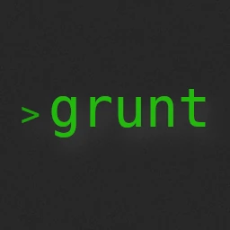

<br/>
<br/>
[](https://goreportcard.com/report/github.com/JGugino/grunt) &nbsp; &nbsp; &nbsp; [](https://github.com/JGugino/grunt/releases/tag/v1.1)


Grunt is a project templating utility which uses a JSON file to define the structure of the project

## Table of Contents
- [Building & Installation](#building-and-installation)
- [Example Project Config](#example-project-config)
    - [Flags](#flags)
    - [Arguments](#flags)
    - [Files](#flags)
- [Creating a Config](#creating-a-config)
- [Executing a Config](#executing-a-config)
- [Accessing Logs](#accessing-logs)
---

## Building and Installation

### Building from source
To build grunt from its source first start by downloading the source files included in your desired release, and then simply run ONE of the following commands depending on your operating system.

#### Windows
```console
make win-build
```
#### Linux
```console
make linux-build
```

#### Windows & Linux
```console
make build-all
```
*NOTE: If you don't want to build your  from source, there are binaries available for each release*

### Adding to Path

#### Windows
Adding grunt to your path on Windows is a very simple process, first start by either downloading or building the binary for your desired version. Once downloaded extract and place the .exe file into a location of your choice and then copy the path. 
<br/>
<br/>
After you have the binary download and in the location you want to search for and open your advanced system settings and then go to your enviroment variables. Once you're there look for a variable name "Path" under the user variables, if it doesn't exist create one and then set its value to the path of the grunt binary. But if it does exist just select it, click edit, and then new, and put in the path to the binary.

*NOTE: You'll have to restart your terminal for the path update to take effect*

#### Linux
To add grunt to your path on linux it's as simple as copying the binary into either your `/usr/locals/bin` or `/usrs/bin` folder. The following command will copy the binary from the current directory to the users `/user/locals/bin`

```console
sudo cp ~/grunt /usr/locals/bin
```
#### Testing your installation 
After you've copied grunt to your `bin` folder (or added the application path to your enviroment variables) you can test your installation by running the command `grunt init`. If everything is setup correctly this will create the `.grunt` directory inside the your home directory. Along with the `.grunt` directory, the config, content, and logs directories are also created. The configs folder is where grunt will look to try and load a config, the content folder is where grunt will look for content that is included inside of a config (more info on this in the [Files](#files) section), and finally the logs folder is where the errors and general logs get created.

---

## Example Project Config

The following example config will create a very basic HTML project with a linked css file. Note this is a very basic example of what could be done using grunt, and is only really meant to give an idea of what grunt is capable of.
```javascript
    {
        "id":"example",
        "args":[
            "name"
        ],
        "directories": [
            {
                "name": "{name}",
                "subDirectories": [
                    {
                        "name": "css",
                        "files": [
                            {
                                "name": "app.css",
                                "content": "--path{app.css}"
                            }
                        ]
                    }
                ],
                "files": [
                    {
                        "name": "index.html",
                        "content": "<html>\n<head>\n<title>Example</title>\n<link rel=\"stylesheet\" href=\"css/app.css\"/></head>\n<body>\n<h1>Example Project</h1>\n</body>\n</html>"
                    }
                ]
            }
        ],
        "commands": [
            {
                "command": "ls",
                "args": [
                    "{name}/",
                    "{name}/css/"
                ]
            }
        ]
    }
```

### Flags
Adding flags to your config gives you the ability to ulter the execution of the config. As of now you have 4 flags that you can apply which affect the directory/file creation, and command steps.
```javascript
    {
        "flags": [
            "skipCreation", //Skips the entire directory & file creation step
            "skipDirs", //Skips the directory creation step
            "skipFiles", //Skips the file creation step
            "skipCommands" //Skips the command execution step
        ]
    }
```

### Arguments
To use an argument within the config you must first define it with the `"args"` section of the config. This section is any array of string which defines the names of the arguments you wish to use, see the example below.
```javascript
    {
        "args":[
            "name",
            "example-arg"
        ]
    }
```
After you have defined your arguments inside the config you may use it in other parts of your config, the only place you cannot use arguments is inside the `"id"` of the config. When using an arg within the config surround the argument name with curly braces, see the example below.
```javascript
    {
        "commands":[
            {
                "command": "ls",
                "args": [
                    "-a"
                    "{name}/" //This argument will be replaced when the config is executed
                ]
            }
        ]
    }
```

**NOTE: If you define arguments inside of the config you must define them when executing that config, if you don't grunt will throw a warning and stop further execution**

### Files
When defining files to be created inside your directories you must define a `"name"` and `"content"` for each file. The files content can either be a plain string written directly inside the config file, but for more complex files you can utilize the `--path{}` modifier to define the name of the file you wish to use. Grunt will look for this file inside the `.grunt/content/{config-id}` directory. The `content` directory will be created on grunts first execution, but the directory for each configs content will need to be created manually.
```javascript
    {
        "files":[
            {
                "name": "content.txt",
                "content": "this is content"
            },
            {
                "name": "index.html",
                "content": "--path{example.html}"
            }
        ]
    }
```

## Creating a Config
When you want to create a new config file you dont have to type out the same bolierplate everytime. You can simply run the `grunt create {name}` command with the name of the config you want and grunt will create the config file and content folder for you.

## Executing a Config
When executing a config using grunt you refer to it by the `"id"` specified inside the config file. Grunt looks for the config file inside the `.grunt/configs` directory within the users home directory, and it will read the first file with a name that matches the id of the specified config.
```console 
grunt example    
```
*this snippet will execute the 'example' config with no arguments inside the current working directory*

### Executing with a defined path
---

By default if a path is not defined grunt will execute the config inside the current working directory, you can define the path by including the `-p` argument followed by the desired path when executing the command, see the example below.
```console
grunt example -p="~/"
```
*this snippet will execute the 'example' config with no arguments inside the specified path which in this case is the users home directory.*

### Executing with arguments
---

When executing a config that contains arguments you must inculde them when executing the command and you refer to them by the name defined inside the config. see the example below.
```console
grunt example name="example-project"
```
*this snippet will execute the 'example' config with the "name" argument inside the current working directory.*

## Accessing Logs
Whenever grunt runs it will logs it's outputs to `general.log`, and any errors that may occur will be logged to `errors.log`. You can access these files either directly by going to the `.grunt/logs` folder inside of your home directory, or you can use the `grunt logs {type}` command and specify the type of log you want to view. So you would run the `grunt logs general` to print out the entire contents of the general log, and `grunt logs error` to view the errors logs.
